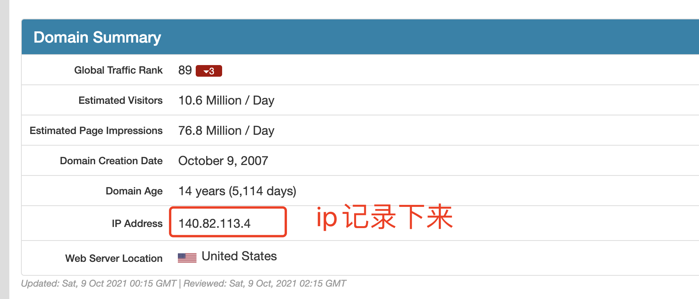
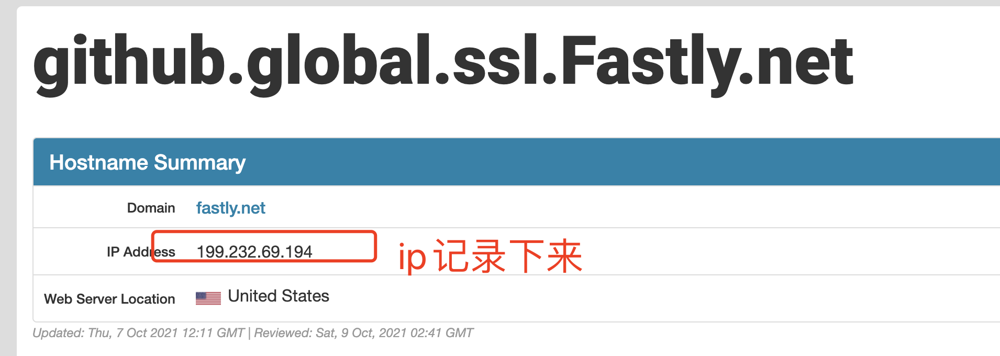
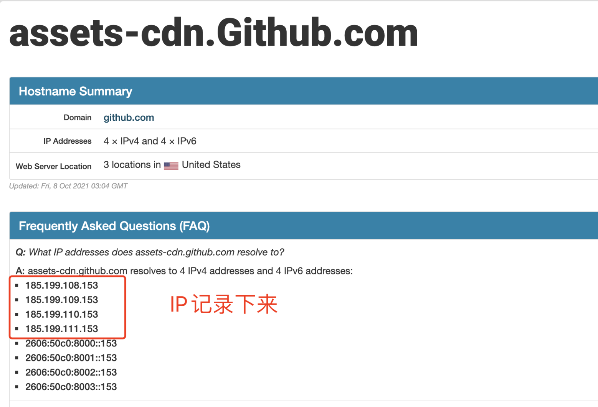

# GitHub,443 Operation timed out的解决办法

1、打开https://github.com.ipaddress.com



2、打开https://fastly.net.ipaddress.com/github.global.ssl.fastly.net#ipinfo 



3、打开https://github.com.ipaddress.com/assets-cdn.github.com 




4、打开电脑的hosts文件，把上面图片记录下来的ip保存即可，也可以下载[SwitchHosts](https://swh.app/zh/)更新hosts文件

```text
140.82.113.4   github.com

199.232.69.194  github.global.ssl.fastly.net

185.199.108.153  assets-cdn.github.com
185.199.109.153  assets-cdn.github.com
185.199.110.153  assets-cdn.github.com
185.199.111.153  assets-cdn.github.com
```
5、更新hosts文件后需要刷新DNS，运行如下2行命令即可

```shell
sudo killall -HUP mDNSResponder
say DNS cache has been flushed
```