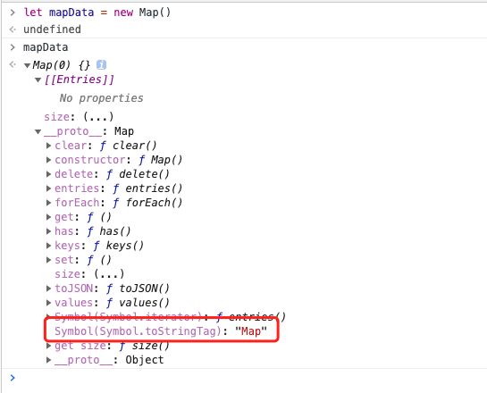
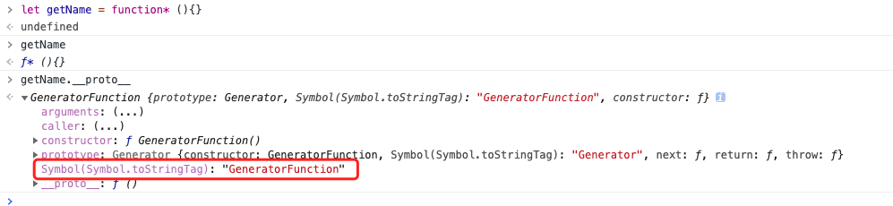

# JS数据类型
---
>基本类型：String,Number,Boolean,null,undefined,Symbol(es6新增),BigInt(es2020新增)。
>
>引用类型：Object,对象子类(Array,Function,Date,RegExp)


# JS类型判断

typeof 可以判断出：Undefined、Boolean、Number、String、Symbol、Function 等类型的数据，但是对于其他的都会认为是 object，比如 Null、Date 等
```js
typeof([])        // "object" 
typeof(/^[1-9]$/) // "object"
typeof(new Date)  // "object"
```
所以通过typeof来判断数据类型会不完全准确。但是可以使用 Object.prototype.toString 实现。

```js
const getType = data=>{
  return Object.prototype.toString.call(data)
}
getType([])        // "[object Array]"
getType({})        // "[object Object]"
getType(/^[1-9]$/) // "[object RegExp]"
getType(new Date)  // "[object Date]"
```

# Symbol.toStringTag

Symbol.toStringTag 是一个内置 symbol，它通常作为对象的属性键使用，对应的属性值应该为字符串类型，这个字符串用来表示该对象的自定义类型标签。

许多内置的 JavaScript 对象类型即便没有 toStringTag 属性，也能被 toString() 方法识别并返回特定的类型标签，如下
```js
Object.prototype.toString.call('name')   // [object String]
Object.prototype.toString.call([])   // [object Array]
Object.prototype.toString.call(1)   // [object Number]
Object.prototype.toString.call(false)   // [object Boolean]
Object.prototype.toString.call(undefined)   // [object Undefined]
Object.prototype.toString.call(null)   // [object Null]
```

另外一些对象也能被 toString() 方法能识别它们是因为引擎为它们设置好了 toStringTag 标签

```js
Object.prototype.toString.call(new Map());       // "[object Map]"
Object.prototype.toString.call(function* () {}); // "[object GeneratorFunction]"
Object.prototype.toString.call(Promise.resolve()); // "[object Promise]"
```
我们可以在控制打印一下这些对象的__proto__ 看看内置的 toStringTag 标签值




我们也可以给自己创建的对象自定义 toStringTag 属性
```js
class Validator {}
Object.prototype.toString.call(new Validator()) // "[object Object]"
```
加上 toStringTag 属性，这个类也会有自定义的类型标签
```js
class Validator {
  get [Symbol.toStringTag]() {
    return "Validator";
  }
}
var o1 = { [Symbol.toStringTag]: "A" };
var o2 = { [Symbol.toStringTag]: null };
Object.prototype.toString.call(new Validator()) // "[object Validator]"
Object.prototype.toString.call(o1);      //  "[object A]"
Object.prototype.toString.call(o2);      //  "[object Object]"
```


